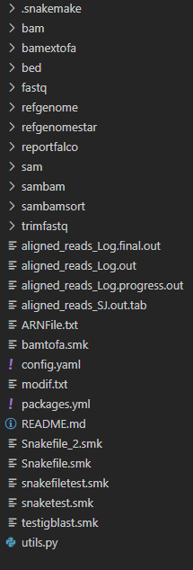

# Snakemake Workflow of Leukemia Diagnosis

This Snakemake workflow performs various bioinformatics operations on a BAM file for molecular diagnosis / prognosis of leukemia, including decompression, quality checking, trimming, alignment, sorting, indexing, chromosome/BED extraction, Sequence Analysis. 

## Requirements

The necessary packages can be installed via conda or pip.

For conda, you can create an environment and install the packages with the following command:

```sh
conda env create -f requirements.yml
```

For pip, first create a virtual environmentW:

```sh
pip install -r requirements.txt
```

### Use the Docker File
It's also possible to use our generated Dockerfile. Please download it using : 
```sh
docker pull gthesprit/cll_env_cmpnb-image
```


## Required Inputs 

This workflow requires a BAM file and a YAML configuration file. The configuration file should specify the following parameters:

- `prefix`: The name of the file without the `.bam` extension.
- `bedfile`: The path to the BED file. If no BED file is provided the default value was 'EMPTY'.
- `chr`: The chromosome to be extracted (e.g., 'chr1'). 
- `isARN`: Set to 'yes' if the input is RNA, 'no' if it is not.

## File Organization for Replicating the Workflow

In order to replicate the workflow, files should be organized in a specific manner. Here are the important directories and their contents:

### bam Directory
This directory should contain the initial BAM file that you wish to process. 

### refgenome Directory
This directory should contain the reference genome, in this case `hg38.fa`. 

### refgenomestar Directory
This directory should contain the index files for the reference genome, which are generated by the STAR tool.

Here is a visual representation of the workflow:



Please make sure the files are organized as described above before running the workflow. 

In addition, ensure the `config.yaml` file is properly filled out with the relevant information as described in the [Required Inputs](#required-inputs) section.

---

Note: The paths in the `config.yaml` file and the `snakemake` command should be adjusted based on your specific directory structure and file locations. Always refer to the official documentation of each tool for more details.


## Running the Workflow

To run the workflow, use the `snakemake` command with the following options:

```bash
snakemake -s snakefile.smk --cores 8 --config prefix=4cd74e8e5c0f2ec4fd155ccad999f585 bedfile=path
snakemake -s snakefile.smk --cores 8 --config prefix=4cd74e8e5c0f2ec4fd155ccad999f585 chr=chr1
snakemake -s snakefile.smk --cores 8 --config prefix=4cd74e8e5c0f2ec4fd155ccad999f585 chr=chr1 isARN=yes
```

Replace `4cd74e8e5c0f2ec4fd155ccad999f585` with your actual file prefix, `8` with the number of the available cores available  and `path` with your actual BED file path or 'EMPTY' if no BED file is provided. Replace `chr1` with the chromosome you want to extract.

It's also possible to just run the following command after change the value of the keys in the `config.yaml` file :
```bash
snakemake -s snakefile.smk --cores 8 
```

## Workflow Steps

Here is an overview of the steps performed by this workflow:

1. **Decompression**: The BAM file is decompressed into three FASTQ files using samtools. These represent paired reads (R1 and R2) and single reads.
2. **Quality Checking**: The quality of the generated FASTQ files is checked using falco.
3. **Trimming**: If the quality is not satisfactory, trimming is performed using fastp. For RNA sequences, trimming is only performed if the quality check failed.
4. **Alignment**: The trimmed FASTQ files are aligned to a reference genome (hg38 in this case) using either STAR (for RNA) or bwa mem (for non-RNA).
5. **Conversion to SAM**: The aligned reads are converted to SAM format using samtools.
6. **Conversion to BAM**: The SAM file is converted back to BAM format using samtools.
7. **Sorting**: The BAM file is sorted using samtools.
8. **Indexing**: The sorted BAM file is indexed using samtools.
9. **Chromosome Extraction**: A specific chromosome or sequence specified in the BED file is extracted using samtools.
10. **Conversion to FASTA**: The BAM file is converted to FASTA format using samtools.

The output of each step is a file or directory, which is used as input for the next step. Each step also generates a 'success' text file with the prefix and a status message.

---

Note: The commands and parameters may vary depending on your specific requirements and environment. Always refer to the official documentation of each tool for more details.
